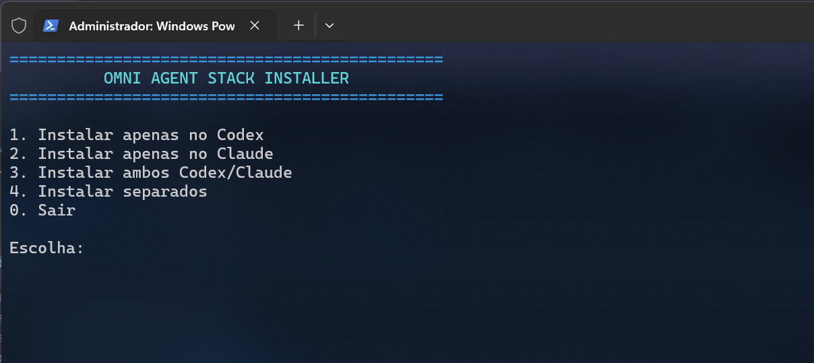
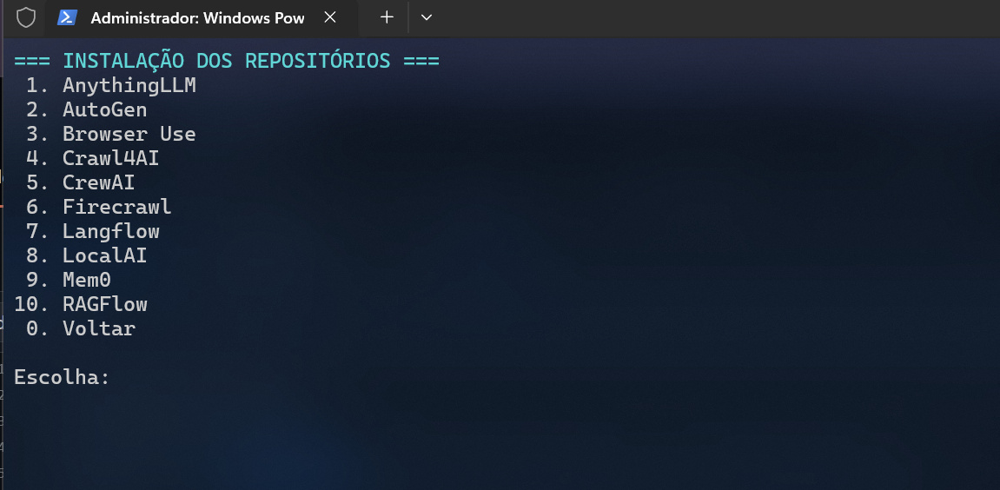

<p align="center">
  <code>=============================== O M N I  A G E N T  S T A C K ===============================</code><br>
  <b><i>Unified AI Agents, RAG, Automation & Local Intelligence Platform</i></b><br><br>
  
  
  
  
  
</p>

## 📸 Interface de Instalação

<p align="center">
  
</p>

<p align="center">
  
</p>

# 🤖 Omni Agent Stack

**Omni Agent Stack** é uma plataforma unificada para instalação, organização e integração de ferramentas open source voltadas a **Agentes de Inteligência Artificial**, **RAG**, **automação**, **memória persistente**, **navegação Web**, **extração de dados** e **execução local de modelos**.

O projeto reúne dez ecossistemas importantes em um único monorepositório, mantendo cada componente isolado em sua própria estrutura e oferecendo scripts interativos para instalação no **Claude Code**, no **OpenAI Codex** ou em ambos.

**Autor:** Romildo — [@thuf86](https://github.com/thuf86)
🌐 **Website:** https://medium.com/@romildothuf
📦 **Versão:** 1.0

---

## 📌 Visão Geral

Diferente de uma simples coleção de links ou submódulos, o Omni Agent Stack foi desenvolvido para criar um ambiente centralizado e extensível para projetos de Inteligência Artificial.

O projeto oferece:

* Download automatizado dos repositórios oficiais
* Consolidação dos projetos em um único monorepositório
* Instalação interativa para Windows e Linux
* Skills especializadas para Claude Code e Codex
* Subagentes dedicados a cada componente
* Instalação individual ou conjunta dos projetos
* Separação segura entre dependências Python, Node.js, Go e Docker
* Registro de origem e commit de cada repositório
* Estrutura preparada para integrações personalizadas

---

## ✨ Principais Recursos

* 🧠 Dez projetos open source de Inteligência Artificial
* 🤖 Agentes especializados por componente
* 🧩 Skills compatíveis com Claude Code
* ⚙️ Skills e instruções compatíveis com OpenAI Codex
* 📦 Instalador interativo
* 🪟 Suporte ao Windows e PowerShell
* 🐧 Suporte ao Linux e Bash
* 🐳 Detecção automática de Docker Compose
* 🐍 Criação de ambientes virtuais Python isolados
* 📜 Detecção de npm, pnpm e yarn
* 🔄 Instalação individual ou completa
* 🗂️ Estrutura organizada em monorepositório
* 🔐 Preservação das licenças originais
* 📍 Registro de origem em `SOURCES.lock.json`

---

## 🧩 Projetos Integrados

| Projeto         | Finalidade                                                            |
| --------------- | --------------------------------------------------------------------- |
| **AnythingLLM** | Plataforma privada para documentos, agentes e múltiplos modelos de IA |
| **AutoGen**     | Framework para criação de sistemas multiagentes                       |
| **Browser Use** | Automação e navegação Web controladas por agentes de IA               |
| **Crawl4AI**    | Web crawler otimizado para LLMs, agentes e pipelines RAG              |
| **CrewAI**      | Orquestração de equipes de agentes especializados                     |
| **Firecrawl**   | Extração, crawling e conversão de conteúdo Web                        |
| **Langflow**    | Construção visual de fluxos e aplicações baseadas em LLM              |
| **LocalAI**     | Execução local de modelos com API compatível com OpenAI               |
| **Mem0**        | Camada de memória persistente para agentes                            |
| **RAGFlow**     | Plataforma completa para Retrieval-Augmented Generation               |

---

## 🗂️ Estrutura do Projeto

```text
OmniAgentStack/
├── components/
│   ├── anything-llm/
│   ├── autogen/
│   ├── browser-use/
│   ├── crawl4ai/
│   ├── crewai/
│   ├── firecrawl/
│   ├── langflow/
│   ├── localai/
│   ├── mem0/
│   └── ragflow/
├── integrations/
├── orchestrator/
├── skills/
├── claude-agents/
├── scripts/
├── AGENTS.md
├── CLAUDE.md
├── SOURCES.lock.json
├── download-and-merge.ps1
├── download-and-merge.sh
├── install-interactive.ps1
├── install-interactive.sh
└── README.md
```

---

## ⚙️ Requisitos

### Windows

* Windows 10 ou superior
* PowerShell 5.1 ou superior
* Git
* Docker Desktop recomendado
* Python 3.10 ou superior
* Node.js LTS
* Espaço em disco disponível para os componentes

### Linux

* Ubuntu, Debian, Fedora, Arch Linux ou distribuição compatível
* Bash
* Git
* Docker e Docker Compose recomendados
* Python 3.10 ou superior
* Node.js LTS

Nem todos os componentes exigem todas as dependências. O instalador identifica o método adequado conforme os arquivos encontrados em cada projeto.

---

## 📥 Download e Consolidação

### Windows

Abra o PowerShell na pasta que contém os scripts:

```powershell
Set-ExecutionPolicy -Scope Process Bypass

.\download-and-merge.ps1 -Destino "C:\OmniAgentStack"
```

O script irá:

1. Baixar os dez repositórios oficiais
2. Armazená-los em `components`
3. Registrar os commits em `SOURCES.lock.json`
4. Criar skills e agentes especializados
5. Remover os repositórios Git internos
6. Inicializar um único repositório Git na raiz

Para evitar erros relacionados ao limite de tamanho de caminhos do Windows, recomenda-se utilizar um caminho curto, como:

```text
C:\OmniAgentStack
```

### Linux

```bash
chmod +x download-and-merge.sh
./download-and-merge.sh "$HOME/OmniAgentStack"
```

---

## 📦 Instalação Interativa

### Windows

```powershell
cd "C:\OmniAgentStack"

Set-ExecutionPolicy -Scope Process Bypass

.\install-interactive.ps1
```

### Linux

```bash
cd "$HOME/OmniAgentStack"

chmod +x install-interactive.sh

./install-interactive.sh
```

---

## 🎛️ Menu Principal

```text
============================================
       OMNI AGENT STACK - INSTALADOR
============================================

1. Instalar/preparar repositórios
2. Instalar agents/skills apenas no Claude Code
3. Instalar skills apenas no Codex
4. Instalar agents/skills no Claude Code e Codex
5. Fazer tudo: repositórios + Claude + Codex
0. Sair
```

---

## 📚 Menu de Componentes

```text
 1. AnythingLLM
 2. AutoGen
 3. Browser Use
 4. Crawl4AI
 5. CrewAI
 6. Firecrawl
 7. Langflow
 8. LocalAI
 9. Mem0
10. RAGFlow
11. Instalar/preparar todos
 0. Voltar
```

Cada componente pode ser preparado individualmente ou em conjunto.

---

## 🤖 Integração com Claude Code

Ao selecionar a instalação para Claude Code, os arquivos são copiados para:

```text
Windows:
C:\Users\SEU_USUARIO\.claude\skills
C:\Users\SEU_USUARIO\.claude\agents

Linux:
~/.claude/skills
~/.claude/agents
```

Cada projeto possui:

* Um skill especializado
* Um subagente dedicado
* Instruções para leitura da documentação
* Regras para preservação da arquitetura upstream
* Orientações para execução de testes
* Regras para proteção de credenciais e segredos

---

## 🧠 Integração com OpenAI Codex

Ao selecionar a instalação para Codex, os arquivos são copiados para:

```text
Windows:
C:\Users\SEU_USUARIO\.codex\skills
C:\Users\SEU_USUARIO\.codex\AGENTS.md

Linux:
~/.codex/skills
~/.codex/AGENTS.md
```

O arquivo `AGENTS.md` fornece instruções permanentes para atuação dentro do monorepositório.

---

## 🔧 Estratégia de Instalação

O instalador identifica automaticamente o método mais seguro disponível.

### Docker Compose

Quando um arquivo Compose é encontrado, o instalador oferece:

```bash
docker compose build
```

### Python

Quando o projeto possui `pyproject.toml` ou `requirements.txt`, é criado um ambiente isolado:

```text
components/<projeto>/.venv
```

### Node.js

O instalador identifica os gerenciadores com base nos lockfiles:

* `pnpm-lock.yaml` → pnpm
* `yarn.lock` → yarn
* `package-lock.json` → npm
* sem lockfile → npm install

Isso evita misturar as dependências dos diferentes projetos na raiz do monorepositório.

---

## 🧱 Arquitetura

Os projetos oficiais são mantidos dentro de:

```text
components/
```

Novas integrações devem ser desenvolvidas em:

```text
integrations/
```

Serviços de coordenação, roteamento e automação devem ser desenvolvidos em:

```text
orchestrator/
```

Essa separação reduz o acoplamento e facilita futuras atualizações dos componentes.

---

## 🔄 Atualizações

Cada download registra:

* Repositório oficial
* Nome do componente
* Commit baixado
* Data da operação

Essas informações ficam armazenadas em:

```text
SOURCES.lock.json
```

O arquivo permite rastrear exatamente qual versão de cada projeto foi incorporada ao monorepositório.

---

## 🛡️ Segurança

* Nunca armazene tokens, senhas ou chaves no Git
* Utilize arquivos `.env` locais
* Preserve os arquivos `.env.example`
* Revise containers antes de expor portas publicamente
* Utilize apenas modelos, extensões e imagens confiáveis
* Verifique as permissões de arquivos e volumes
* Execute automações Web apenas em ambientes autorizados

---

## 🙏 Créditos e Projetos Originais

O Omni Agent Stack existe graças ao trabalho das comunidades e mantenedores dos projetos abaixo.

### AnythingLLM

* Repositório: [Mintplex-Labs/anything-llm](https://github.com/Mintplex-Labs/anything-llm)
* Organização: Mintplex Labs
* Diretório local: `components/anything-llm`

### AutoGen

* Repositório: [microsoft/autogen](https://github.com/microsoft/autogen)
* Organização: Microsoft
* Diretório local: `components/autogen`

### Browser Use

* Repositório: [browser-use/browser-use](https://github.com/browser-use/browser-use)
* Organização: Browser Use
* Diretório local: `components/browser-use`

### Crawl4AI

* Repositório: [unclecode/crawl4ai](https://github.com/unclecode/crawl4ai)
* Mantenedores: Crawl4AI Contributors
* Diretório local: `components/crawl4ai`

### CrewAI

* Repositório: [crewAIInc/crewAI](https://github.com/crewAIInc/crewAI)
* Organização: CrewAI
* Diretório local: `components/crewai`

### Firecrawl

* Repositório: [firecrawl/firecrawl](https://github.com/firecrawl/firecrawl)
* Organização: Firecrawl
* Diretório local: `components/firecrawl`

### Langflow

* Repositório: [langflow-ai/langflow](https://github.com/langflow-ai/langflow)
* Organização: Langflow
* Diretório local: `components/langflow`

### LocalAI

* Repositório: [mudler/LocalAI](https://github.com/mudler/LocalAI)
* Mantenedores: LocalAI Contributors
* Diretório local: `components/localai`

### Mem0

* Repositório: [mem0ai/mem0](https://github.com/mem0ai/mem0)
* Organização: Mem0
* Diretório local: `components/mem0`

### RAGFlow

* Repositório: [infiniflow/ragflow](https://github.com/infiniflow/ragflow)
* Organização: InfiniFlow
* Diretório local: `components/ragflow`

---

## ⚖️ Licenciamento

A licença do código original do Omni Agent Stack deve ser definida separadamente das licenças dos projetos incorporados.

---

## 📢 Aviso Legal

O Omni Agent Stack:

* Não substitui os projetos originais
* Não reivindica autoria sobre os componentes incorporados
* Não é patrocinado oficialmente pelos respectivos mantenedores
* Não representa uma distribuição oficial dos projetos
* Atua exclusivamente como ferramenta de agregação, instalação e organização

Todos os nomes, marcas e códigos pertencem aos seus respectivos autores e organizações.

---

## 🗺️ Roadmap

* Interface Web unificada
* Orquestrador central de agentes
* Atualização automatizada dos componentes
* Catálogo de skills
* Marketplace de agentes
* API REST centralizada
* Suporte a MCP
* Dashboard de serviços
* Observabilidade e logs
* Gerenciamento de modelos locais
* Perfis de instalação
* Backup e restauração de configurações

---

## ⭐ Apoie o Projeto

Caso o Omni Agent Stack seja útil para seu ambiente de desenvolvimento, considere deixar uma estrela no repositório.

Também visite e apoie os projetos originais utilizados pela plataforma.

---

<p align="center">
  Desenvolvido por <b>Romildo — thuf86</b><br>
  Construído com respeito e reconhecimento à comunidade open source.
</p>
